# Phase 6: Itasha And Template Intelligence - Research

**Researched:** 2026-06-18
**Domain:** Codebase-local schema, prompt, worker rendering, and workbench UI extension
**Confidence:** HIGH

<user_constraints>
## User Constraints (from CONTEXT.md)

### Locked Decisions

- D-01: Add a small, explicit set of itasha-oriented fields: character focus, supporting graphics, racing/JDM cues, typography intent, and color harmony.
- D-02: Extend the existing structured brief/parameter workflow. Do not create a new wizard, landing page, or separate editor.
- D-03: Defaults preserve the current local deterministic generation path.
- D-04: Treat exact text/logo rendering as deterministic preview layers where possible, not as a claim that the AI raster generated perfect text.
- D-05: Record overlay intent/spec separately from the base generated artifact. Any baked preview composite remains labeled as concept preview.
- D-06: Uploaded logos must respect asset rights/source status; missing-rights assets stay blocked.
- D-07: Add lightweight rule-based warnings for resolution, template/view normalization, text readability, risky zones, and rights metadata.
- D-08: Warnings are mostly non-blocking. Rights violations remain blocking.
- D-09: Warning copy is concise and operational.
- D-10: Keep Phase 6 to `generic-side-coupe` / `side`.
- D-11: Safe-zone overlays are data-driven concept guidance for broad panel zones, not installer-accurate templates.
- D-12: Unsupported templates/views normalize to the supported template/view with warnings.
- D-13: Store renderer-neutral preview-spec data in existing version parameters, artifact metadata, or brief payload fields before adding new core job APIs.
- D-14: Preview spec includes canvas size, template id/view, safe-zone data, overlay descriptors, warning ids/messages, and source artifact/version references.
- D-15: Preview spec is readable through existing API responses.
- D-16: Integrate Phase 6 into the existing workbench parameter, preview, comparison, export, and manifest surfaces.
- D-17: Maintain the quiet operational layout from Phases 4-5.
- D-18: Mobile remains single-column with no horizontal document scroll at 390px and ideally 320px.

### the agent's Discretion

- Exact field names, storage location among existing JSON fields, safe-zone geometry format, overlay renderer selection, warning thresholds, and whether local deterministic previews are baked or preview-only are implementation details.

### Deferred Ideas (OUT OF SCOPE)

- Accurate vehicle-specific wrap templates, UV maps, production scale/bleed/DPI, layered source packages, installer proofing, true Three.js/React Three Fiber 3D, mask/inpainting, ControlNet/IP-Adapter, LoRA, multi-view consistency, provider orchestration, broad licensed libraries, marketplace/community, and quote/order/payment flows.
</user_constraints>

<phase_requirements>
## Phase Requirements

| ID | Description | Research Support |
|----|-------------|------------------|
| QUAL-01 | Itasha-oriented fields for character focus, supporting graphics, racing/JDM cues, typography intent, and color harmony | Existing `GenerationBriefPayload` and `GenerationBriefUpdateRequest` already support structured JSON extension [VERIFIED: repo] |
| QUAL-02 | Exact text strings and uploaded logos through deterministic layers/overlays where possible | Existing preview panel can add bounded overlay state; local worker uses Pillow for deterministic concept rendering [VERIFIED: repo] |
| QUAL-03 | Lightweight warnings for resolution, template data, text readability, risky zones, rights metadata | `warnings` already exists on brief payload and template normalization already emits warning strings [VERIFIED: repo] |
| QUAL-04 | Panel or safe-zone overlays for supported templates | `templates.py` owns supported template/view/canvas constants and is the right home for safe-zone data [VERIFIED: repo] |
| QUAL-05 | Store preview specification data for later 3D without core design/job API changes | `DesignVersion.parameters`, `Artifact.metadata`, `ModelRun.prompt_payload`, and `ExportRecord.manifest` already carry JSON data through existing responses [VERIFIED: repo] |
</phase_requirements>

## Summary

Phase 6 can be implemented without new libraries or new API routes. The stable path is to extend existing Pydantic brief/prompt/template contracts in `services/core`, expose the changed schema through FastAPI/OpenAPI, keep durable `PreviewSpec` data in existing JSON-bearing fields, and render UI controls inside the current workbench panels. [VERIFIED: repo]

The worker already builds prompt payloads, creates design versions, creates artifacts, and records provider metadata. The lowest-risk path is metadata-first: persist `preview_spec` on `DesignVersion.parameters` and mirror relevant provider metadata on artifacts/exports, while optionally adding deterministic Pillow overlay rendering to the local provider only as concept-preview evidence. [VERIFIED: repo]

**Primary recommendation:** Create a five-plan Phase 6: core preview contract, worker/provider metadata, contracts/API refresh, workbench UI, and docs/verification.

## Architectural Responsibility Map

| Capability | Primary Tier | Secondary Tier | Rationale |
|------------|--------------|----------------|-----------|
| Brief field validation and defaults | Core generation module | API schemas | `GenerationBriefPayload` is the canonical structured payload used by API and worker [VERIFIED: repo] |
| Safe-zone and template data | Core generation template module | Web preview | `resolve_vehicle_template()` already owns supported template/view normalization [VERIFIED: repo] |
| Prompt payload and PreviewSpec assembly | Core prompt planner | Worker task | `build_prompt_plan()` already preserves prompt payload JSON consumed by providers [VERIFIED: repo] |
| Reference rights blocking | Worker/data service | Web UI disabled states | Worker already calls `_require_confirmed_reference_rights()` before provider generation [VERIFIED: repo] |
| Deterministic concept overlay rendering | Worker local provider | Web preview layer | `LocalDeterministicImageProvider` already uses Pillow and prompt payload metadata [VERIFIED: repo] |
| Workbench controls and preview toggles | Web client | Zustand local state | Parameter edits save through API; preview zoom/view are local UI state [VERIFIED: repo] |
| PreviewSpec visibility and export manifest | Core export service + web export panel | Worker metadata | `record_export()` already merges `version.parameters` into manifest [VERIFIED: repo] |

## Standard Stack

### Core

| Library | Version | Purpose | Why Standard |
|---------|---------|---------|--------------|
| Pydantic | `>=2.13,<3` in core, `2.13.4` in API, `2.13.1` in worker | Typed brief/prompt payloads and FastAPI schemas | Existing cross-service contract layer [VERIFIED: repo] |
| SQLAlchemy asyncio | `>=2.0,<3` | JSON metadata persistence and job/version/artifact services | Existing data service layer [VERIFIED: repo] |
| FastAPI | `0.136.1` | API contract exposure and OpenAPI export | Existing control-plane API [VERIFIED: repo] |
| Celery | `5.6.3` | Async generation job execution | Existing worker queue [VERIFIED: repo] |
| Pillow | `>=12.2.0` | Local deterministic concept rendering | Existing local provider renderer [VERIFIED: repo] |
| Next.js / React / TypeScript | Next `16.2.6`, React `19.2.4`, TypeScript `6.0.3` | Workbench UI | Existing frontend stack [VERIFIED: repo] |
| Zustand | `5.0.12` | Local preview/inspector UI state | Existing workbench store pattern [VERIFIED: repo] |
| Vitest / Testing Library | Vitest `3.2.4`, Testing Library React `16.3.0` | Frontend regression tests | Existing web test suite [VERIFIED: repo] |

### Supporting

| Library | Version | Purpose | When to Use |
|---------|---------|---------|-------------|
| Orval | `8.8.0` | Generated TypeScript contracts from OpenAPI | After schema/API changes [VERIFIED: repo] |
| lucide-react | `0.468.0` | Workbench icon buttons | For overlay/safe-zone/action icons [VERIFIED: repo] |

### Alternatives Considered

| Instead of | Could Use | Tradeoff |
|------------|-----------|----------|
| CSS/SVG overlay in existing preview panel | react-konva/Konva | Not needed for Phase 6 because preview overlays are simple rectangles/polygons and repo does not currently install Konva [VERIFIED: repo] |
| Metadata-first PreviewSpec in existing JSON fields | New preview API routes/tables | New routes add surface area without being required by D-13/D-15 [VERIFIED: repo] |
| Pillow concept overlay in local provider | Hosted provider-specific text rendering | Hosted provider behavior is Phase 7/provider strategy scope and exact text should remain deterministic [VERIFIED: repo] |

## Architecture Patterns

### System Architecture Diagram

```mermaid
flowchart LR
  User["Workbench user edits brief"] --> Web["ParameterPanel + PreviewPanel"]
  Web --> API["FastAPI generation brief routes"]
  API --> Core["GenerationBriefPayload + template resolver"]
  Core --> Prompt["PromptPlan with PreviewSpec payload"]
  Prompt --> Worker["Celery generate_2d_concept_job"]
  Worker --> Provider["LocalDeterministicImageProvider"]
  Provider --> Ledger["Version parameters + artifact metadata"]
  Ledger --> WebState["Existing generation state API responses"]
  WebState --> Preview["Overlay toggles + PreviewSpec panel + export manifest"]
```



### Recommended Project Structure

```text
services/core/src/caragent_core/generation/
  briefs.py       # Structured itasha fields, overlay intent, warning validation
  templates.py    # Supported template metadata and safe-zone data
  prompts.py      # Prompt payload and PreviewSpec assembly
services/worker/src/caragent_worker/
  providers/local.py  # Deterministic concept-preview rendering
  tasks/jobs.py       # Store preview_spec on version/artifact metadata
apps/web/src/components/workbench/
  parameter-panel.tsx # Itasha controls and warnings
  preview-panel.tsx   # Overlay/safe-zone toggles and bounded layers
  export-panel.tsx    # PreviewSpec/manifest visibility
apps/web/src/lib/workbench/
  store.ts            # Local overlay visibility state
```

### Pattern 1: Extend Existing Brief JSON

**What:** Add optional/list fields to `GenerationBriefPayload`, thread them through create/update requests, and keep defaults compatible with existing brief creation.

**When to use:** QUAL-01 fields and overlay intent data.

**Example:**

```python
class GenerationBriefPayload(BaseModel):
    character_focus: str | None = None
    supporting_graphics: list[str] = Field(default_factory=list)
```

Source: `services/core/src/caragent_core/generation/briefs.py` [VERIFIED: repo]

### Pattern 2: Metadata-First PreviewSpec

**What:** Build a renderer-neutral dict in core prompt planning and store it in existing JSON fields.

**When to use:** QUAL-05 without changing core route shape.

**Example:**

```python
prompt_payload["preview_spec"] = {
    "canvas": {"width": brief.canvas_width, "height": brief.canvas_height},
    "template": {"id": brief.vehicle_template_id, "view": brief.view},
}
```

Source: `services/core/src/caragent_core/generation/prompts.py`, `services/worker/src/caragent_worker/tasks/jobs.py` [VERIFIED: repo]

### Pattern 3: Workbench UI Extension

**What:** Add controls to existing panels and use local Zustand state for preview visibility toggles.

**When to use:** QUAL-01, QUAL-02, QUAL-04 UI behavior.

**Example:**

```typescript
const showSafeZones = useWorkbenchStore((state) => state.showSafeZones);
```

Source: `apps/web/src/components/workbench/parameter-panel.tsx`, `apps/web/src/lib/workbench/store.ts` [VERIFIED: repo]

### Anti-Patterns to Avoid

- Adding a new route or table for PreviewSpec before existing JSON fields are exhausted. This contradicts D-13. [VERIFIED: context]
- Treating AI-generated raster text as exact deterministic text. This contradicts D-04. [VERIFIED: context]
- Enabling missing-rights logos in overlays because overlays are "only preview." This contradicts D-06/D-08 and existing worker rights checks. [VERIFIED: repo]
- Broadening beyond `generic-side-coupe` / `side` in Phase 6. This contradicts D-10/D-12. [VERIFIED: context]

## Don't Hand-Roll

| Problem | Don't Build | Use Instead | Why |
|---------|-------------|-------------|-----|
| New frontend state library | Custom event bus or React context rewrite | Existing Zustand store | Store already owns preview local state [VERIFIED: repo] |
| New API client | Manual fetch helpers for new routes | Existing generated contracts and wrappers | API contract drift is already guarded [VERIFIED: repo] |
| New canvas engine | Custom drawing abstraction or Konva install | CSS/SVG overlay over stable preview container; Pillow for local baked preview if needed | Required shapes are simple and bounded [VERIFIED: repo] |
| New persistence tables | Dedicated preview_spec table | Existing JSON fields on version/artifact/export/prompt payload | Matches D-13/D-15 [VERIFIED: context] |

## Runtime State Inventory

Step skipped: Phase 6 is not a rename, rebrand, refactor, or migration phase.

## Common Pitfalls

### Pitfall 1: Optional Fields Breaking Existing Fixtures

**What goes wrong:** Pydantic additions become required and existing tests/briefs fail.
**Why it happens:** Adding fields without defaults to `GenerationBriefPayload`.
**How to avoid:** New Phase 6 fields must default to `None`, `""` handled at UI boundary, or `default_factory=list`.
**Warning signs:** Existing Phase 3-5 fixtures fail before Phase 6 behavior is exercised.

### Pitfall 2: Frontend-Only PreviewSpec

**What goes wrong:** Browser can render overlays but developer cannot inspect durable spec data from API responses.
**Why it happens:** Storing overlay/safe-zone state only in Zustand.
**How to avoid:** Keep visibility toggles local, but persist renderer-neutral spec in version/artifact/export metadata.
**Warning signs:** Refresh loses spec data or export manifest has no preview-spec summary.

### Pitfall 3: Rights Gate Regression

**What goes wrong:** Logo overlay selection bypasses confirmed-rights enforcement.
**Why it happens:** Treating asset overlay as separate from generation references.
**How to avoid:** UI disables missing-rights logo overlays, and worker continues checking reference assets.
**Warning signs:** Missing-rights asset id appears in overlay candidates or prompt input without warning.

### Pitfall 4: Preview Overlay Causing Layout Drift

**What goes wrong:** Safe-zone layer changes panel size or overlaps controls on mobile.
**Why it happens:** Overlay container is not positioned inside a fixed preview area.
**How to avoid:** Use bounded absolute overlay inside the existing preview container and preserve panel min height/aspect ratio.
**Warning signs:** `document.documentElement.scrollWidth > clientWidth` during Browser UAT.

## Code Examples

### Existing Brief Update Pattern

```python
current = GenerationBriefPayload.model_validate(brief.payload)
update_payload = payload.model_dump(exclude_unset=True)
updated = GenerationBriefPayload(**(current.model_dump() | update_payload))
```

Source: `services/api/src/caragent_api/routes/generation.py` [VERIFIED: repo]

### Existing Version Parameter Storage

```python
version = await jobs.create_design_version(
    session,
    job.workspace_id,
    parameters={"concept_label": request.concept_label, "model": provider_result.model},
)
```

Source: `services/worker/src/caragent_worker/tasks/jobs.py` [VERIFIED: repo]

### Existing Export Manifest Merge

```python
export_manifest = {
    **(manifest or {}),
    "disclaimer": CONCEPT_EXPORT_DISCLAIMER,
    "parameters": version.parameters,
}
```

Source: `services/core/src/caragent_core/services/jobs.py` [VERIFIED: repo]

## State of the Art

External state-of-the-art research is not required for Phase 6 because no new library, model provider, or hosted AI capability is introduced. The relevant standard is the project's existing contract-first and metadata-first architecture. [VERIFIED: repo]

## Assumptions Log

No assumptions recorded. All implementation-relevant claims are verified from repository files or locked Phase 6 context.

## Open Questions (RESOLVED)

1. **Should Phase 6 install Konva/react-konva for overlays?**
   - RESOLVED: No. Existing dependencies do not include Konva, and simple CSS/SVG overlay shapes satisfy QUAL-04 without a new rendering dependency.
2. **Where should PreviewSpec be stored?**
   - RESOLVED: Use existing JSON fields first: `DesignVersion.parameters`, artifact metadata, prompt payload, and export manifest.
3. **Should broad vehicle template support be planned?**
   - RESOLVED: No. Phase 6 is locked to `generic-side-coupe` / `side`.

## Environment Availability

| Dependency | Required By | Available | Version | Fallback |
|------------|-------------|-----------|---------|----------|
| Node/pnpm/Corepack | Web/contracts generation and tests | yes | Root package manager `pnpm@11.0.8`; user switched Node to NVM 22.15.0 | Use approved escalated `corepack pnpm ...` commands when sandboxed spawn hits EPERM |
| Python/uv | Core/API/worker tests | yes | Services require Python `>=3.13,<3.14` | Use approved `uv` commands; escalate when uv cache permissions block |
| Docker Compose | Smoke and live UAT | yes | User started Docker service during Phase 5 | Local non-Docker unit tests still available |
| PostgreSQL/Redis/MinIO | Docker smoke/live generation | yes via compose | Project compose stack | Not needed for unit-only planning |

## Validation Architecture

### Test Framework

| Property | Value |
|----------|-------|
| Core framework | pytest 9.x with ruff/mypy |
| API framework | pytest 9.x with httpx, ruff, mypy |
| Worker framework | pytest 9.x with ruff, mypy |
| Web framework | Vitest 3.2.4 + Testing Library + ESLint + TypeScript |
| Contract framework | Orval generation + TypeScript check |
| Quick run command | `uv run pytest -q tests/test_generation_briefs.py` or targeted service tests |
| Full suite command | `corepack pnpm validate` |

### Phase Requirements to Test Map

| Req ID | Behavior | Test Type | Automated Command | File Exists? |
|--------|----------|-----------|-------------------|--------------|
| QUAL-01 | Itasha fields parse, validate, update, and prompt payload includes them | core/api/web unit | `uv run pytest -q tests/test_generation_briefs.py`; `uv run pytest -q tests/test_generation_routes.py`; `corepack pnpm --filter @caragent/web test -- --run apps/web/src/app/page.test.tsx` | core route tests exist; new focused core test may be needed |
| QUAL-02 | Text/logo overlay intent is stored and eligible assets respect rights | core/worker/web unit | `uv run pytest -q tests/test_generation_tasks.py`; `corepack pnpm --filter @caragent/web test -- --run apps/web/src/app/page.test.tsx` | worker/web tests exist |
| QUAL-03 | Warning list includes template/readability/risky-zone/rights signals and renders in UI | core/web unit | `uv run pytest -q tests/test_generation_briefs.py`; `corepack pnpm --filter @caragent/web test -- --run apps/web/src/app/page.test.tsx` | warnings UI exists; warning generation tests need additions |
| QUAL-04 | Safe-zone data is present for supported template and toggles render bounded overlay | core/web unit + Browser UAT | `uv run pytest -q tests/test_templates.py`; `corepack pnpm --filter @caragent/web test -- --run apps/web/src/app/page.test.tsx` | template tests may need new file |
| QUAL-05 | PreviewSpec data survives through version/artifact/export responses | worker/api/web unit + smoke | `uv run pytest -q tests/test_generation_tasks.py`; `uv run pytest -q tests/test_job_services.py`; `corepack pnpm contracts:check` | service/worker tests exist |

### Sampling Rate

- Per backend task commit: targeted `uv run pytest -q ...` plus ruff/mypy for touched service.
- Per frontend task commit: targeted `corepack pnpm --filter @caragent/web test -- --run apps/web/src/app/page.test.tsx`, then web lint/typecheck.
- Per contract change: export OpenAPI, generate contracts, then `corepack pnpm contracts:check`.
- Phase gate: `corepack pnpm validate`, `corepack pnpm smoke:local`, and Browser desktop/mobile UAT.

### Wave 0 Gaps

- Create or extend `services/core/tests/test_generation_briefs.py` and/or `services/core/tests/test_templates.py` if no focused tests exist for new Phase 6 data.
- Add web fixture fields in `apps/web/src/app/page.test.tsx` for PreviewSpec and itasha fields.

## Security Domain

### Applicable ASVS Categories

| ASVS Category | Applies | Standard Control |
|---------------|---------|------------------|
| V2 Authentication | no | No auth feature in Phase 6 |
| V3 Session Management | no | Local workspace persistence unchanged |
| V4 Access Control | limited | Preserve workspace/version/artifact ownership checks in existing services |
| V5 Input Validation | yes | Pydantic validation in core/API; UI disables invalid/missing-rights assets |
| V6 Cryptography | limited | Existing SHA256 artifact checksum path remains unchanged |

### Known Threat Patterns for Phase 6

| Pattern | STRIDE | Standard Mitigation |
|---------|--------|---------------------|
| Untrusted text overlay content stored in JSON | Tampering / XSS | React text rendering, no raw HTML insertion, Pydantic list/string normalization |
| Logo/reference asset rights bypass | Repudiation / Information Disclosure | Preserve `assets.require_confirmed_rights()` worker check and disable missing-rights overlay candidates |
| Manifest leaking local paths or secrets | Information Disclosure | Reuse manifest tests that reject drive paths/API keys/secrets |
| Oversized overlay/warning text breaking mobile layout | Denial of Service UX | Bound text with wrapping/truncation and Browser overflow checks |

## Sources

### Primary (HIGH confidence)

- `.planning/phases/06-itasha-and-template-intelligence/06-CONTEXT.md` - locked Phase 6 decisions.
- `.planning/phases/06-itasha-and-template-intelligence/06-UI-SPEC.md` - UI contract.
- `.planning/ROADMAP.md` and `.planning/REQUIREMENTS.md` - Phase goal and QUAL requirements.
- `AGENTS.md` - project architecture and GSD constraints.
- `package.json`, `apps/web/package.json`, `packages/contracts/package.json`, service `pyproject.toml` files - local stack and commands.
- `services/core/src/caragent_core/generation/*.py`, `services/core/src/caragent_core/services/jobs.py`, `services/worker/src/caragent_worker/tasks/jobs.py`, `services/worker/src/caragent_worker/providers/local.py` - implementation patterns.
- `apps/web/src/components/workbench/*.tsx`, `apps/web/src/lib/workbench/store.ts`, `apps/web/src/app/page.test.tsx` - frontend patterns and tests.

### Secondary (MEDIUM confidence)

- None needed.

### Tertiary (LOW confidence)

- None used.

## Metadata

**Confidence breakdown:**
- Standard stack: HIGH - verified from local manifests.
- Architecture: HIGH - verified from project docs and code paths.
- Pitfalls: HIGH - derived from existing Phase 3-5 implementation and Phase 6 locked decisions.

**Research date:** 2026-06-18
**Valid until:** 2026-07-18 for local codebase planning; re-check external package/model versions only if adding new providers or dependencies.
