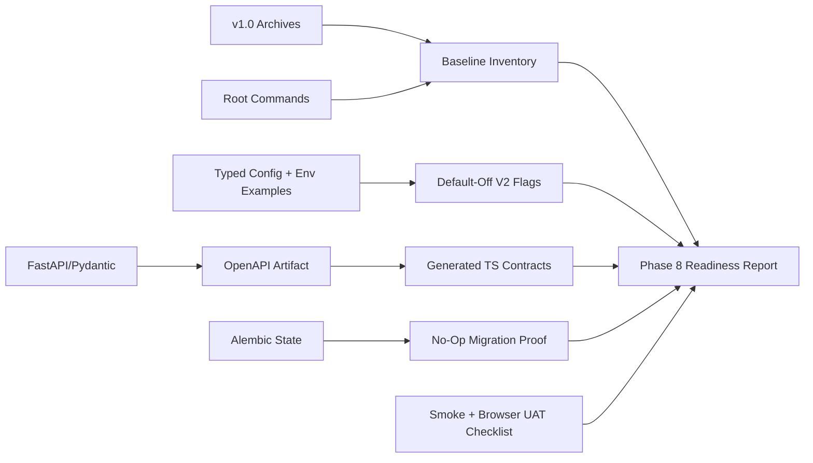

# Phase 8: V1 Closure And V2 Readiness Gate - Research

**Researched:** 2026-06-18
**Domain:** Release readiness, compatibility gates, local validation, and default-off rollout scaffolding
**Confidence:** HIGH

<user_constraints>
## User Constraints (from CONTEXT.md)

### Locked Decisions

- Phase 8 is a readiness gate, not a product expansion phase.
- V1 local-only mode remains the safety anchor and must work without hosted provider credentials.
- V2 flags must be inert and default-off.
- Existing v1 records, generated contracts, and `PreviewSpec` paths remain canonical and readable.
- Hosted provider production readiness remains Phase 9 scope; Phase 8 may document/guard only.

### the agent's Discretion

- Exact feature flag names, readiness report structure, and no-op migration proof format can be chosen during planning.
- Planner may add focused tests around config defaults and contract compatibility where existing tests do not prove the gate.

### Deferred Ideas (OUT OF SCOPE)

- Real hosted provider generation and manual hosted smoke execution.
- Targeted region/layer editing and mask assets.
- Reference role assignment and provider-specific reference guidance.
- Lightweight 3D preview shell and screenshots.
- Enhanced concept handoff ZIP package.
</user_constraints>

<architectural_responsibility_map>
## Architectural Responsibility Map

| Capability | Primary Tier | Secondary Tier | Rationale |
|------------|-------------|----------------|-----------|
| V1 baseline inventory | Planning/docs | Git history | Evidence lives in `.planning/milestones/`, README, and runbook; no runtime feature required. |
| V2 default-off flags | API/Worker config | Web public env | Runtime flags must be typed server-side first; web only receives non-secret display/enablement flags. |
| Contract compatibility | API/OpenAPI | Contracts package, web wrappers | FastAPI/Pydantic exports define generated TypeScript clients consumed by web. |
| Migration safety | API/Alembic | Core models | Database compatibility is owned by Alembic/core schema; Phase 8 should prove no-op or safe migration behavior. |
| Smoke/UAT readiness | Scripts/docs | Browser/manual UAT | Existing root commands are the verification vocabulary; Phase 8 organizes evidence and gaps. |
</architectural_responsibility_map>

<research_summary>
## Summary

Phase 8 should use the repository's existing validation surfaces instead of inventing new architecture. The strongest current evidence is the v1.0 milestone archive, `docs/development.md`, root `package.json` scripts, generated OpenAPI contracts, API/worker typed settings, and Phase 7 operations tests/smoke path.

The standard approach for this phase is a release-readiness gate: inventory the prior release, add inert/default-off flags for upcoming capabilities, verify contract and migration compatibility, then close with a smoke/UAT checklist. This creates confidence for Phase 9 without making hosted provider behavior active early.

**Primary recommendation:** Keep Phase 8 boring and evidence-driven: default-off flags, compatibility checks, no-op migration proof, and a readiness report tied to existing root commands.
</research_summary>

<standard_stack>
## Standard Stack

### Core

| Tool | Version/Source | Purpose | Why Standard |
|------|----------------|---------|--------------|
| pnpm | `packageManager` in `package.json` | Root scripts and workspace commands | Existing project command surface. |
| uv | service `pyproject.toml` files | Python service sync, lint, typecheck, tests | Existing API/core/worker workflow. |
| FastAPI/Pydantic OpenAPI | `services/api` | API contract source | Existing TypeScript contracts are generated from OpenAPI. |
| Alembic | `services/api/alembic` | Migration state | Existing database schema evolution path. |
| Vitest/pytest/ruff/mypy/tsc/eslint | package/service configs | Validation | Existing local verification suite. |

### Supporting

| Tool | Purpose | When to Use |
|------|---------|-------------|
| `scripts/validate-all.mjs` | Aggregate local validation | Baseline confidence before/after Phase 8 changes. |
| `scripts/check-contracts.mjs` | Contract drift guard | Any API/schema/client change. |
| `scripts/smoke-local.mjs` | Docker-backed local smoke | Prove local DB/object/queue basics. |
| `scripts/smoke-worker-queue.mjs` | Live worker queue smoke | Prove API -> Redis/Celery -> worker -> durable output path. |

### Alternatives Considered

| Instead of | Could Use | Tradeoff |
|------------|-----------|----------|
| Existing root scripts | New readiness runner | More code and maintenance before proving current gates. |
| Default-off flags | Enable partial V2 behavior | Violates phase boundary and risks cost/provider side effects. |
| No-op migration proof | Real schema migration | Premature unless a concrete V2 schema extension is implemented in later phases. |
</standard_stack>

<architecture_patterns>
## Architecture Patterns

### Readiness Gate Data Flow



### Recommended Project Structure

```text
.planning/phases/08-v1-closure-and-v2-readiness-gate/
├── 08-01-PLAN.md
├── 08-02-PLAN.md
├── 08-03-PLAN.md
├── 08-04-PLAN.md
├── 08-05-PLAN.md
├── 08-READINESS-BASELINE.md
├── 08-MIGRATION-SAFETY.md
├── 08-VERIFICATION.md
└── 08-HUMAN-UAT.md
```

### Pattern 1: Default-Off Feature Flags

**What:** Define upcoming V2 switches in env examples and typed settings, default them to disabled, and test that local mode remains unchanged.
**When to use:** Before introducing multi-phase capabilities that must be independently disableable.

### Pattern 2: Compatibility Script Or Checklist

**What:** Check that expected v1 routes/schemas/scripts still exist and contracts remain generated from API state.
**When to use:** Before schema-extending phases.

### Anti-Patterns to Avoid

- **Turning on hosted generation in Phase 8:** This belongs to Phase 9 and can create cost or moderation surprises.
- **Inventing a parallel validation system:** Root scripts already define the trusted command vocabulary.
- **Claiming production handoff readiness:** V2 still only prepares concept/review workflows.
</architecture_patterns>

<dont_hand_roll>
## Don't Hand-Roll

| Problem | Don't Build | Use Instead | Why |
|---------|-------------|-------------|-----|
| Contract drift | Custom JSON diff by hand | Existing OpenAPI export plus `pnpm contracts:check` | Already wired into project. |
| Migration state | Manual SQL inspection only | Alembic commands and migration files | Matches current API schema workflow. |
| Smoke orchestration | New service supervisor | Existing `infra:up`, API/worker/web commands, smoke scripts | Preserves documented Windows-first local flow. |
| Hosted safety | Hidden implicit env behavior | Explicit typed settings and env examples | Keeps secrets/server-only flags out of browser code. |
</dont_hand_roll>

<common_pitfalls>
## Common Pitfalls

### Pitfall 1: Readiness Phase Becomes Feature Phase

**What goes wrong:** Phase 8 starts implementing hosted generation or UI flows that belong to later phases.
**Why it happens:** The V2 roadmap contains tempting future features nearby.
**How to avoid:** Keep plans scoped to flags, compatibility, no-op migration proof, and evidence.
**Warning signs:** Plans mention new provider requests, new edit masks, or new 3D viewer behavior.

### Pitfall 2: Local Baseline Accidentally Requires Hosted Secrets

**What goes wrong:** New config validation fails unless real provider keys exist.
**Why it happens:** Server settings treat V2 provider readiness as required in local mode.
**How to avoid:** Default all V2 flags off and assert local mode works with empty hosted provider keys.
**Warning signs:** `pnpm validate` or smoke fails on missing `AI_PROVIDER_*` secrets.

### Pitfall 3: Contract Parser Misses V2 Requirement IDs

**What goes wrong:** Plan coverage gates miss `V2-READY-*` requirements because automatic parsing returned null.
**Why it happens:** Phase text uses V2-prefixed IDs and current tooling did not extract them from ROADMAP.
**How to avoid:** Put requirement IDs explicitly in every plan frontmatter.
**Warning signs:** `init plan-phase 8` reports `phase_req_ids: null`.
</common_pitfalls>

<validation_architecture>
## Validation Architecture

Phase 8 validation should combine static artifact checks, focused config/contract tests, and smoke/UAT evidence:

1. Static checks: v1.0 archive files exist, Phase 8 context/research/plans exist, readiness report references required artifacts.
2. Config checks: V2 flags default off; local mode accepts empty hosted provider secrets.
3. Contract checks: `pnpm contracts:check` passes and generated client remains in sync.
4. Migration checks: Alembic can upgrade to head; Phase 8 no-op migration proof documents whether schema changed.
5. Smoke/UAT checks: root validation, Docker local smoke, worker dry-run/live smoke where host prerequisites allow, and Browser readiness UAT.
</validation_architecture>

<sources>
## Sources

### Primary (HIGH confidence)

- `README.md` — root commands and shipped phase behavior.
- `docs/development.md` — detailed local runbook, smoke, provider guardrails, UAT, troubleshooting.
- `package.json` — authoritative root script definitions.
- `.env.example` and service env examples — local and provider config contract.
- `.planning/milestones/v1.0-MILESTONE-AUDIT.md` — passed v1.0 audit and known deferred scope.
- `.planning/phases/08-v1-closure-and-v2-readiness-gate/08-CONTEXT.md` — locked Phase 8 decisions.

### Secondary (MEDIUM confidence)

- `services/api/tests/*`, `services/worker/tests/*`, `apps/web/src/**/*.test.ts*` — likely focused coverage points.
- `packages/contracts/openapi/openapi.json` and `packages/contracts/src/generated/client.ts` — current generated contract state.
</sources>

<metadata>
## Metadata

**Research scope:**
- Core technology: local validation and release-readiness gating.
- Ecosystem: existing monorepo scripts, OpenAPI contracts, Alembic, API/worker settings.
- Patterns: default-off flags, no-op migration proof, compatibility reports.
- Pitfalls: premature provider enablement, local secret requirements, missed requirement coverage.

**Confidence breakdown:**
- Standard stack: HIGH — repo commands and configs are present.
- Architecture: HIGH — Phase 8 does not require new external libraries.
- Pitfalls: HIGH — directly derived from roadmap and v1.0 audit.
- Code examples: N/A — this phase should avoid new algorithmic implementation patterns.

**Research date:** 2026-06-18
**Valid until:** 2026-07-18 for local readiness patterns; re-check hosted provider details in Phase 9.
</metadata>

---

*Phase: 08-v1-closure-and-v2-readiness-gate*
*Research completed: 2026-06-18*
*Ready for planning: yes*
